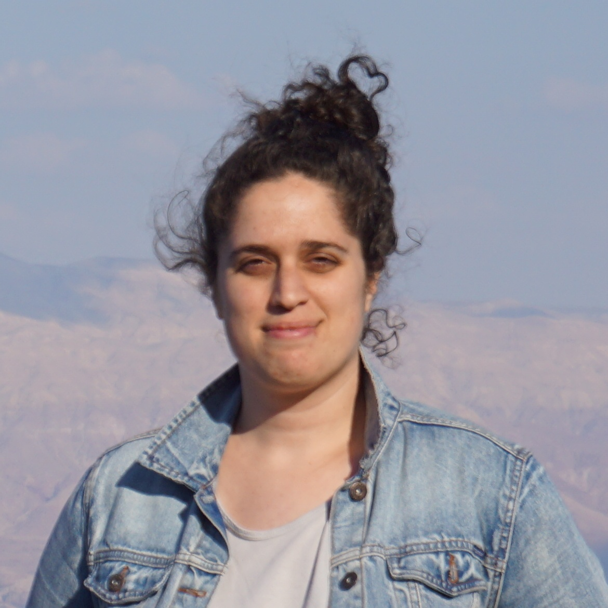

#### Today




- PhD student in Computer Science, [Weizmann Institute of Science](https://weizmann.ac.il){:target="_blank"}

- I am extremely fortunate to be advised by [Guy Rothblum](https://guyrothblum.wordpress.com/){:target="_blank"}
- My research focuses on issues of fairness and non-discrimination in machine learning. More generally, I am interested in the computational perspectives of incorporating societal concerns, such as interpretability and privacy, into machine learning methods.
- I periodically blog about general machine learning topics at [Medium](https://towardsdatascience.com/@galyona){:target="_blank"}

#### Before

- MSc in Computer Science, [Weizmann Institute of Science](https://weizmann.ac.il){:target="_blank"}
- Machine learning at [Cellebrite](https://www.cellebrite.com/en/home/){:target="_blank"}
- BSc in Mathematics and Economics, [Hebrew University](https://new.huji.ac.il/){:target="_blank"}

*contact*: gal.yona at gmail.com
